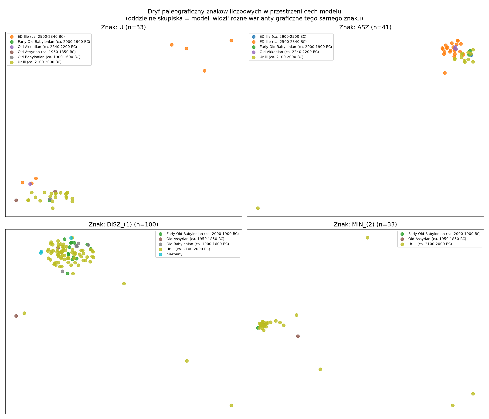
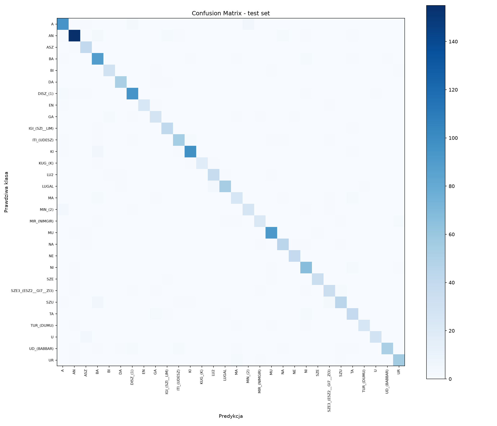

# Cuneiform Sign Classifier

Classification of individual cuneiform signs (Sumerian/Akkadian) on images of
3D-rendered clay tablets, using transfer learning. A portfolio project
demonstrating a full ML workflow: exploring a niche, challenging dataset,
methodologically sound training, and deep error analysis connecting model
results with domain knowledge (paleography).



## Why this project

Cuneiform is one of the oldest writing systems in the world and still an
active area of digital humanities research — a recent (2026) paper describes
an end-to-end OCR pipeline for this script
([arXiv:2606.22608](https://arxiv.org/abs/2606.22608)), which served as a
reference point. Instead of another cats-vs-dogs classifier, this project
tackles real challenges: a niche, imbalanced dataset, inconsistencies in the
metadata, and domain-specific data augmentation.

## Results at a glance

| Metric | Result |
|---|---|
| Number of classes | Top 30 most frequent signs |
| Test accuracy | 90.4% |
| Test macro-F1 | 0.896 |
| Model | ResNet18 (transfer learning), CPU-only |
| Dataset | [MaiCuBeDa Hilprecht](https://doi.org/10.11588/DATA/QSNIQ2) |

Full per-class `classification_report` produced by `evaluate.py` / see the
[Detailed Results](#detailed-results) section below.

## Dataset

**MaiCuBeDa Hilprecht** (Mainz Cuneiform Benchmark Dataset), Homburg & Mara
2023, released under **CC BY-SA 4.0**. Contains ~28.7k annotated individual
cuneiform signs, rendered from 3D models of tablets from the Hilprecht
Collection (MSII rendering — a curvature-based filter, reported in the
literature to work better for sign detection/classification than plain
lighting).

**Realistic scope:** instead of full OCR of entire texts (a PhD-scale
problem), this project focuses on **classifying a single, already-cropped
sign** — the top 30 most frequent classes, selected based on the actual
distribution in the data (each class has at least 203 examples after
filtering, covering ~44% of the full annotation set).

### Data quality issue encountered

The `Filename` field in the metadata CSV (`translitmetadata.csv`) **does not
match the actual filenames** in the published image archive (a different
number of fields — likely a dataset versioning artifact). Solution: instead
of matching by the filename from the CSV, `build_dataset.py` **parses
filenames directly from disk** and maps each sign's transliteration to its
class name via a separate lookup table built from the CSV (923 unique
readings, only 18 ambiguous, resolved by majority vote).

## Methodology

- **Train/val/test split (70/15/15) grouped by tablet**, not by individual
  image — the same sign from the same tablet never ends up in two splits at
  once. Verified with unit tests (`tests/test_no_leakage.py`, 8 tests,
  including an explicit check for no overlap between tablet sets).
- **Class weights** (inverse frequency) in the loss function — moderate
  imbalance (~5x between the most and least frequent of the top-30 classes).
- **Model selected by macro-F1 on val, not accuracy** — to avoid favoring
  frequent classes.
- **Augmentation without mirror flips.** A standard `RandomHorizontalFlip`
  would be a methodological error here — mirroring a cuneiform sign changes
  its identity. Only small rotation (±8°) and light brightness/contrast
  jitter were used.
- **Transfer learning with partial freezing** — ResNet18's `layer1`/`layer2`
  frozen (general low-level features), `layer3`/`layer4`/`fc` trained. A
  quality/training-time trade-off for CPU training.

## Detailed Results

### Confusion matrix



A clear diagonal — the model is systematically correct, with errors that are
rare and concentrated. The top confusions (`LUGAL→LU2`, `A↔MIN_(2)`) are
explainable by visual similarity of the signs' graphical components, not
random — confirmed geometrically in the embedding analysis below.

### Discovery: paleographic drift of the sign `U`

EDA on sample images revealed that the sign `U` (the number "10") has a
**physically different form** depending on the historical period: a round
indentation in the oldest tablets (ED IIIa/b, ~2500-2600 BC) vs. a clear
triangular wedge in later periods. This is a documented paleographic
phenomenon — early cuneiform partly used a round stylus for writing numbers.

**Verified quantitatively** (`evaluate.py`, accuracy per period):

| Period | Accuracy for `U` |
|---|---|
| Ur III, Old Assyrian, Old Babylonian, Old Akkadian, Early OB | 100% |
| **ED IIIb (ca. 2500-2340 BC)** | **43% (3/7)** |

**Verified geometrically** (`embeddings.py`, t-SNE on 512-dim feature
vectors): the sign `U` forms **two completely separate clusters** in the
model's feature space, corresponding to the two graphical variants — whereas,
e.g., `ASZ` (100% accuracy regardless of period) forms a single coherent
cluster. The model "sees" the same discrepancy a human notices visually.

This shows a model limitation stemming directly from the imbalance in the
training data (64% of it is Ur III) — not from an architectural flaw.

### Interpretability (Grad-CAM)

The demo app visualizes Grad-CAM for every prediction — confirming that the
model bases its decisions on the sign itself (not on the clay texture in the
background).

## Demo (Streamlit)

An interactive app: pick an example from the test gallery → top-1 prediction
+ top-3 with confidence → a warning on low confidence → Grad-CAM
visualization.

```bash
streamlit run app.py
```

or via Docker (see below).

**Live demo:** _add your Streamlit Community Cloud URL here once deployed_

### Deploying to Streamlit Community Cloud

The trained checkpoint (`checkpoints/best_model.pt`, ~123MB) and the full
test set (`data/processed/`) are gitignored — too large/regenerable to
commit. To make the app runnable from a fresh clone (which is what
Streamlit Community Cloud does):

- A small curated gallery of test images is committed under
  `demo_samples/` (~120 images, a handful per class) — `app.py` falls back
  to it automatically whenever `data/processed/test` isn't present.
- The model checkpoint is fetched at runtime from the **Hugging Face
  Hub** instead of being committed to the repo.

Steps:

1. Create a free account at [huggingface.co](https://huggingface.co) if you
   don't have one.
2. Create a new **Model** repo (e.g. `<your-username>/cuneiform-sign-classifier`).
3. Upload `checkpoints/best_model.pt` to it (web UI "Add file", or the `huggingface_hub` CLI:
   `huggingface-cli upload <your-username>/cuneiform-sign-classifier checkpoints/best_model.pt`).
4. In `app.py`, set `HF_REPO_ID` to that repo id (it defaults to
   `slastrzelec/cuneiform-sign-classifier`).
5. Commit and push (`app.py`, `requirements.txt`, `demo_samples/`).
6. On [share.streamlit.io](https://share.streamlit.io), create a new app
   pointing at this repo, branch `main`, main file path `app.py`.

The first load after a deploy/restart will be a bit slower while the
checkpoint downloads from HF Hub (~123MB); `st.cache_resource` keeps it
in memory afterwards, and `huggingface_hub` caches the file on disk too.

## Project structure

```
cuneiform-sign-classifier/
├── src/
│   ├── __init__.py
│   └── data.py              # DataLoaders, augmentation, class weights
├── tests/
│   └── test_no_leakage.py   # 8 dataset integrity tests
├── build_dataset.py          # Dataset parsing, top-N filtering, split
├── eda.py                    # Class/period distribution, image size, samples
├── train.py                  # Training (transfer learning, resumable)
├── evaluate.py                # Confusion matrix, per-period error analysis
├── embeddings.py              # t-SNE visualization of the feature space
├── app.py                     # Streamlit demo + Grad-CAM
├── Dockerfile / .dockerignore
├── requirements.txt
└── eda_outputs/                # Generated plots (kept in repo for README)
```

## Reproducing the project from scratch

```bash
conda create -n TABL python=3.11 -y
conda activate TABL
conda install pytorch torchvision cpuonly -c pytorch -y
conda install -c conda-forge pandas numpy pillow matplotlib jupyter scikit-learn seaborn tqdm -y
pip install pytest streamlit

# 1. Download MaiCuBeDa Hilprecht: https://doi.org/10.11588/DATA/QSNIQ2
#    (translitmetadata.csv + one of the image zips, e.g. MSII)
# 2. Build the dataset (adjust paths in the CONFIG section at the top of the file)
python build_dataset.py
# 3. Verify there is no data leakage
pytest tests/test_no_leakage.py -v
# 4. EDA (optional)
python eda.py
# 5. Training (resumable - safe to interrupt and re-run)
python train.py
# 6. Evaluation and error analysis
python evaluate.py
python embeddings.py
# 7. Demo
streamlit run app.py
```

### Docker

**Note:** building the image requires a locally trained
`checkpoints/best_model.pt` (the checkpoint is not part of the repository —
see `.gitignore` — so run step 5 above, `python train.py`, first).

```bash
docker build -t cuneiform-sign-classifier .
docker run -p 8501:8501 cuneiform-sign-classifier
```

## Limitations and future directions

- **Only the top-30 classes** — the full cuneiform sign inventory has
  hundreds of signs with a strong long tail (93 classes have only 1 example
  in the entire dataset). Extending this would require either few-shot
  learning or oversampling rare classes.
- **Imbalance across historical periods** (64% Ur III) limits generalization
  to older graphical variants — directly documented via the sign `U`.
- **Classification, not detection** — the model assumes the sign has already
  been cropped from the tablet. A natural extension: a detection +
  classification pipeline on the full tablet (cf. eBL, arXiv:2606.22608).
- The **MSII** rendering was used for training; the dataset also provides
  `VirtualLight` — whether combining renderings would improve generalization
  remains untested.

## Citation / data sources

- Homburg, T., Mara, H. (2023). *MaiCuBeDa Hilprecht — Mainz Cuneiform
  Benchmark Dataset*. Heidelberg University. CC BY-SA 4.0.
  https://doi.org/10.11588/DATA/QSNIQ2
- Mara, H. (2019). *HeiCuBeDa Hilprecht*. https://doi.org/10.11588/data/IE8CCN
- Automated sign detection across the Electronic Babylonian Library (2026).
  arXiv:2606.22608

## Author

Sławomir Strzelec — AI/ML Engineer & Data Scientist, Kraków
[Portfolio](https://slastrzelec.github.io/portfolio/) ·
[GitHub](https://github.com/slastrzelec) ·
[LinkedIn](https://linkedin.com/in/sławomir-strzelec)
